# DN5.0-JavaFSE-Solutions

**Name:** Sachin M R  
**Email:** sachinramalingam.m@gmail.com  
**Superset ID:** 7988784

---

## Week 1

### Module 1 — Design Patterns and Principles

| # | Exercise | Output |
|---|----------|--------|
| 1 | **Singleton Pattern** — [Logger.java](Module-1/Design%20Patterns%20and%20Principles/SingletonPatternExample/src/com/singleton/Logger.java) | — |
| 2 | **Factory Method Pattern** — [DocumentFactory.java](Module-1/Design%20Patterns%20and%20Principles/FactoryMethodPatternExample/src/com/Factory/DocumentFactory.java) | — |
| 3 | **Builder Pattern** — [Computer.java](Module-1/Design%20Patterns%20and%20Principles/BuilderPatternExample/src/com/Builder/Computer.java) |  |
| 4 | **Adapter Pattern** — [PaymentProcessor.java](Module-1/Design%20Patterns%20and%20Principles/AdapterPatternExample/src/com/Adapter/PaymentProcessor.java) |  |
| 5 | **Decorator Pattern** — [NotifierDecorator.java](Module-1/Design%20Patterns%20and%20Principles/DecoratorPatternExample/src/com/Decorator/NotifierDecorator.java) |  |
| 6 | **Proxy Pattern** — [ProxyImage.java](Module-1/Design%20Patterns%20and%20Principles/ProxyPatternExample/src/Code/ProxyImage.java) |  |

---

### Module 2 — Data Structures and Algorithms

| # | Exercise | Output |
|---|----------|--------|
| 1 | **Employee Management System** — [Array.java](Module-2/Data%20structures%20and%20Algorithms/Employee_Management_System/src/code/Array.java) |  |
| 2 | **Sorting Customer Orders** — [Bubble_sort.java](Module-2/Data%20structures%20and%20Algorithms/Sorting_Customer_Orders/src/code/Bubble_sort.java) |  |
| 3 | **Inventory Management System** — [InventoryManager.java](Module-2/Data%20structures%20and%20Algorithms/InventoryManagementSystem/src/code/InventoryManager.java) |  |
| 4 | **E-commerce Platform Search Analysis** — [Search.java](Module-2/Data%20structures%20and%20Algorithms/E_commercePlatform/src/code/Search.java) |  |
| 5 | **Financial Forecasting** — [FinancialForecast.java](Module-2/Data%20structures%20and%20Algorithms/Financiala_Forecasting/src/code/FinancialForecast.java) |  |

---

### Module 3 — PL/SQL

| # | Exercise | Output |
|---|----------|--------|
| 1 | **Control Structures** — [Control Structures_code.sql](Module-3/PL_SQL/Control_Structures/Control%20Structures_code.sql) | 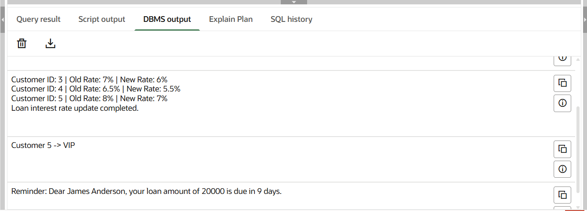 |
| 2 | **Stored Procedures** — [Stored Procedures.sql](Module-3/PL_SQL/Stored_Procedures/Stored%20Procedures.sql) | 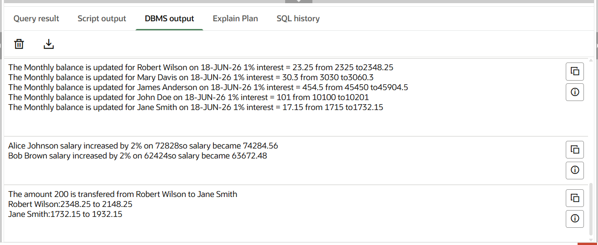 |

---

### Module 4 — Test Driven Development and Logging Framework

#### JUnit Basic Testing

| # | Exercise | Output |
|---|----------|--------|
| 1 | **Setting Up JUnit** — [pom.xml](Module-4/JUnit_Basic_Testing/Setting_Up_JUnit/pom.xml) | 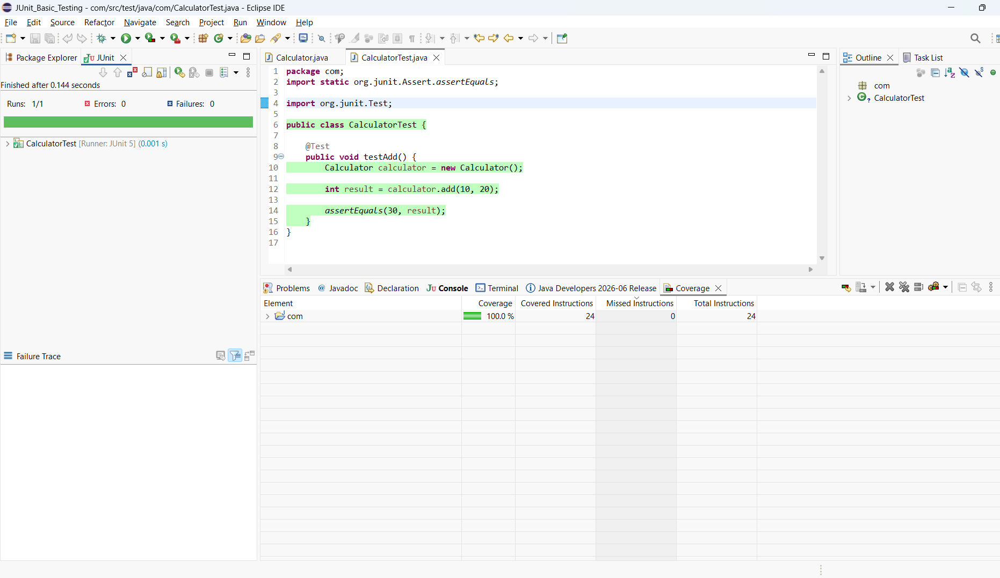 |
| 2 | **Writing Basic JUnit Tests** — [CalculatorTest.java](Module-4/JUnit_Basic_Testing/Writing_Basic_JUnit_Tests/src/test/java/CalculatorTest.java) | 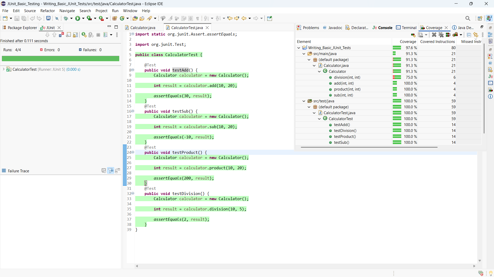 |
| 3 | **Arrange-Act-Assert Pattern** — [CalculatorTest.java](Module-4/JUnit_Basic_Testing/Arrange-Act-Assert_Pattern/src/test/java/CalculatorTest.java) | 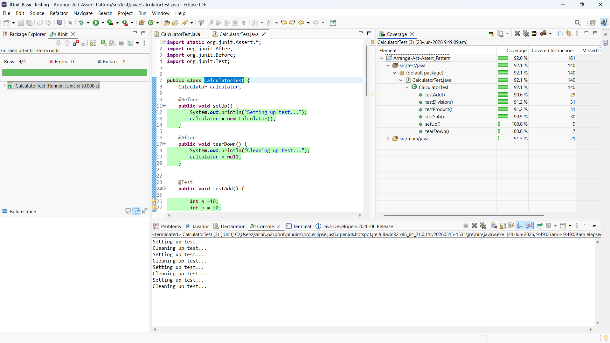 |
| 4 | **Assertions in JUnit** — [CalculatorTest.java](Module-4/JUnit_Basic_Testing/Assertions_in_JUnit/src/test/java/CalculatorTest.java) | 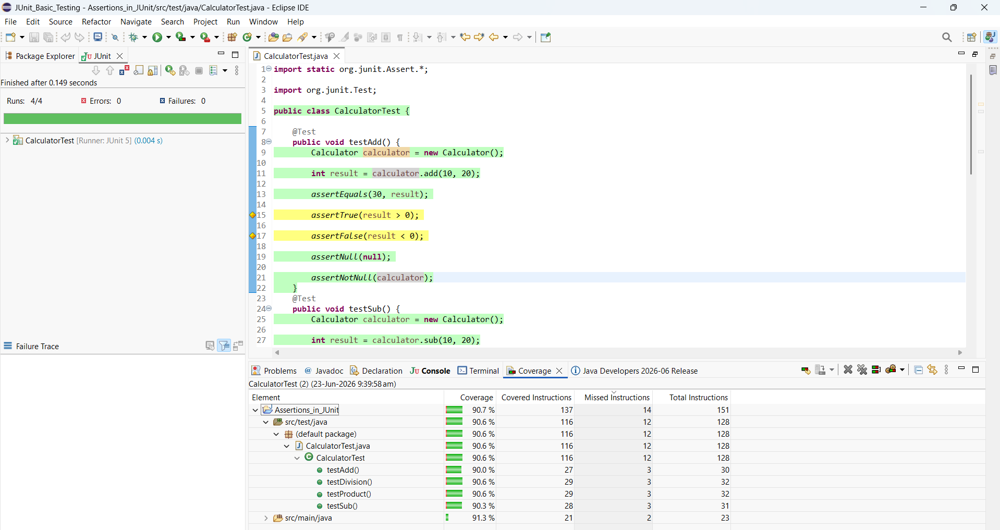 |

#### Mockito Exercises

| # | Exercise | Output |
|---|----------|--------|
| 1 | **Mocking and Stubbing** — [src](Module-4/Mockito_exercises/Ex_1-Mocking_and_Stubbing/src/) | 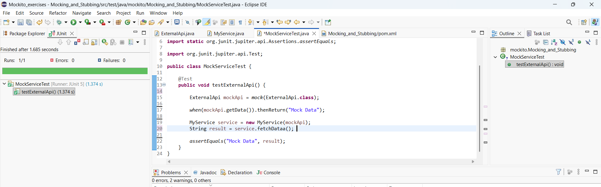 |
| 2 | **Verifying Interactions** — [src](Module-4/Mockito_exercises/Ex_2-Verifying_Interactions/src/) |  |
| 3 | **Argument Matching** — [src](Module-4/Mockito_exercises/Ex_3-Argument_Matching/src/) | 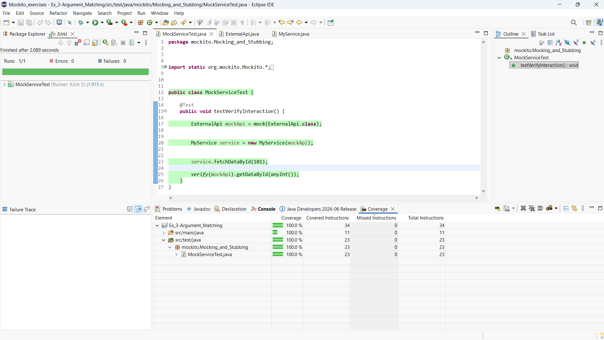 |
| 4 | **Handling Void Methods** — [src](Module-4/Mockito_exercises/Ex_4-Handling_Void_Methods/src/) | 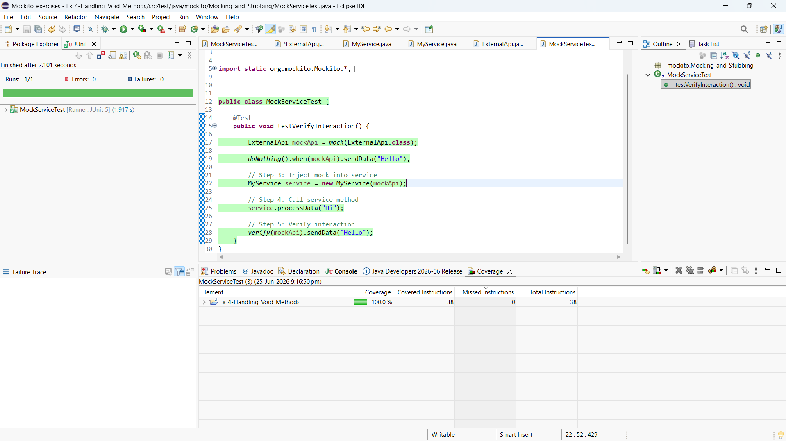 |
| 5 | **Mocking & Stubbing with Multiple Returns** — [src](Module-4/Mockito_exercises/Ex_5-Mocking_and_Stubbing_with_Multiple_Returns/src/) | 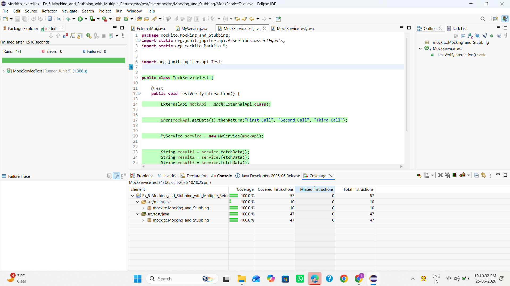 |
| 6 | **Verifying Interaction Order** — [src](Module-4/Mockito_exercises/Ex_6-Verifying_Interaction_Order/src/) | 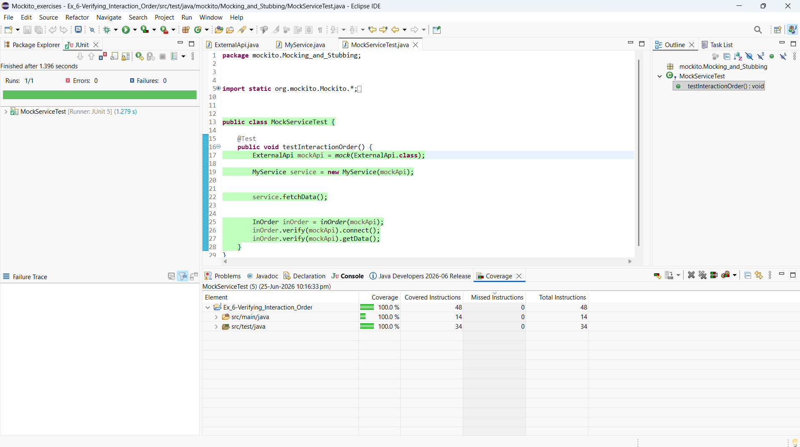 |
| 7 | **Handling Void Methods with Exceptions** — [src](Module-4/Mockito_exercises/Ex_7-Handling_Void_Methods_with_Exceptions/src/) | 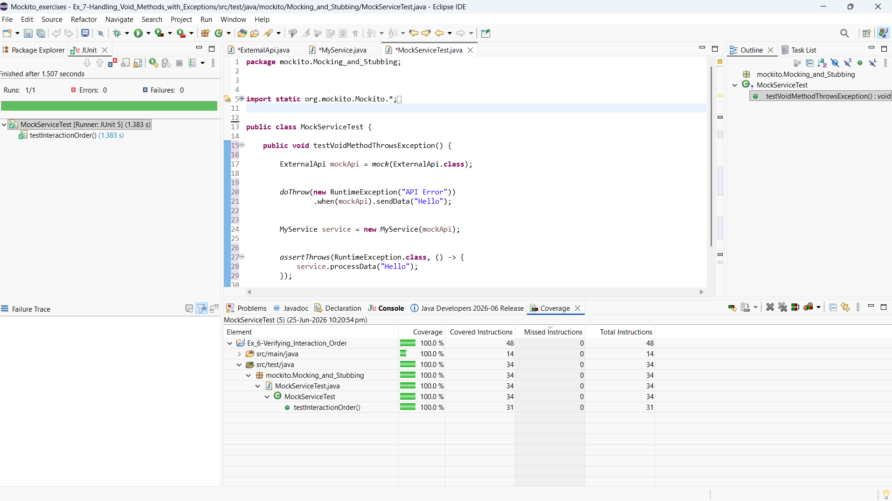 |

#### SL4J Logging

| # | Exercise | Output |
|---|----------|--------|
| 1 | **Logging Error Messages and Warning Levels** — [src](Module-4/SL4J%20Logging%20exercise/Exercise_1-Logging_Error_Messages_and_Warning_Levels/src/) | — |
| 2 | **Parameterized Logging** — [src](Module-4/SL4J%20Logging%20exercise/Exercise_2-Parameterized_Logging/src/) | — |
| 3 | **Using Different Appenders** — [src](Module-4/SL4J%20Logging%20exercise/Exercise_3-Using_Different_Appenders/src/) | — |

---

## Week 2

### Module 5 — Spring Core with Maven

| # | Exercise | Output |
|---|----------|--------|
| 1 | **Configuring a Basic Spring Application** — [Main.java](Module-5/Spring_Core_Maven/Exercise_1-Configuring_a_Basic_Spring_Application/src/main/java/com/library/Main.java) | 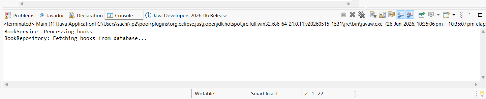 |
| 2 | **Implementing Dependency Injection** — [LibraryManagementApplication.java](Module-5/Spring_Core_Maven/Exercise_2-Implementing_Dependency_Injection/src/main/java/com/library/LibraryManagementApplication.java) |  |
| 3 | **Creating and Configuring a Maven Project** — [pom.xml](Module-5/Spring_Core_Maven/Exercise_4-Creating_and_Configuring_a_Maven_Project/pom.xml) | — |
| 4 | **Configuring the Spring IoC Container** — [LibraryManagementApplication.java](Module-5/Spring_Core_Maven/Exercise_5-Configuring_the_Spring_IoC_Container/src/main/java/com/library/LibraryManagementApplication.java) | 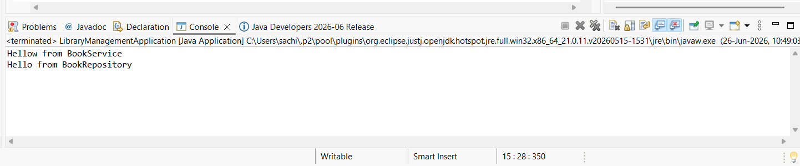 |
| 5 | **Implementing Constructor and Setter Injection** — [src](Module-5/Spring_Core_Maven/Exercise_7-Implementing_Constructor_and_Setter_Injection/src/) |  |
| 6 | **Implementing Basic AOP with Spring** — [Main.java](Module-5/Spring_Core_Maven/Exercise_8_Implementing_Basic_AOP_with_Spring/src/main/java/com/library/Main.java) | 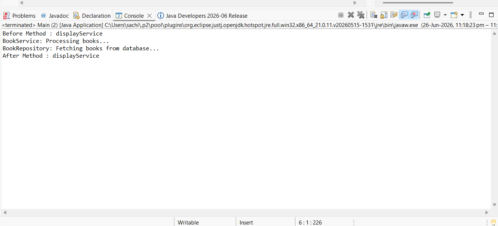 |

---

### Module 6 — Spring Data JPA with HyperNet

| # | Exercise | Output |
|---|----------|--------|
| 1 | **Handson 1** — Country CRUD (Spring Data JPA) | 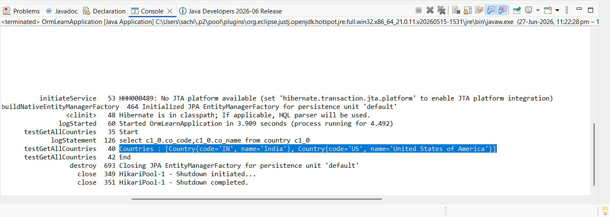 |
| 2 | **Handson 5** — Country Service Implementation | 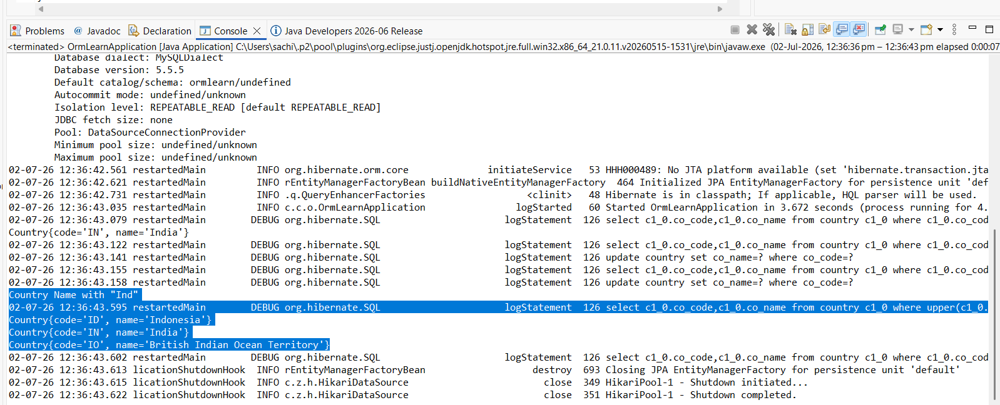 |
| 3 | **Handson 6** — Find Country with Exception Handling | 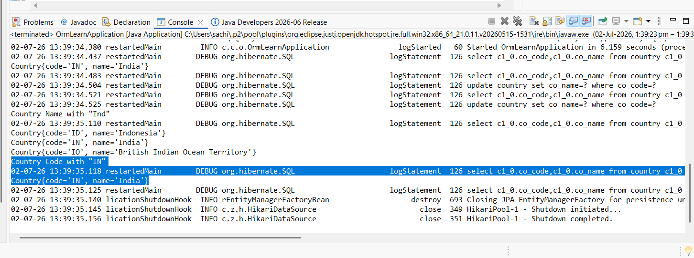 |

---

## Week 3

### Module 7 — Spring REST

| # | Exercise | Output |
|---|----------|--------|
| 1 | **Handson 1 — Create a Spring Web Project using Maven** — [spring-learn](Module-7%20--Spring%20rest/Spring-rest-Handson%201/1.Create%20a%20Spring%20Web%20Project%20using%20Maven/spring-learn/) | — |
| 2 | **Handson 1 — Load Country from Spring Configuration XML** — [Country.java](Module-7%20--Spring%20rest/Spring-rest-Handson%201/2%20.Load%20Country%20from%20Spring%20Configuration%20XML/spring-learn/) |  |
| 3 | **Handson 2 — Hello World RESTful Web Service** — [HelloController.java](Module-7%20--Spring%20rest/Spring-rest-Handson%202/1.Hello%20World%20RESTful%20Web%20Service/Hello%20World%20RESTful%20Web%20Service/) |  |
| 4 | **Handson 2 — Get Country based on Country Code** — [CountryController.java](Module-7%20--Spring%20rest/Spring-rest-Handson%202/2%20Get%20country%20based%20on%20country%20code/Get%20country%20based%20on%20country%20code/) |  |
| 5 | **Handson 2 — REST Country Web Service** — [CountryController.java](Module-7%20--Spring%20rest/Spring-rest-Handson%202/3%20.REST%20-%20Country%20Web%20Service/REST%20-%20Country%20Web%20Service/) |  |
| 6 | **Handson 5 — Create Authentication Service that returns JWT** — [SecurityConfig.java](Module-7%20--Spring%20rest/Spring-rest-Handson%205/1%20.Create%20authentication%20service%20that%20returns%20JWT/Securing%20RESTful%20Web%20Services%20with%20Spring%20Security/) |  |

---

## Week 4

### Module 8 — Microservices

| # | Exercise | Output |
|---|----------|--------|
| 1 | **Creating Microservices for Account and Loan** — [Account Microservice](Module-8%20--MicroService/Creating%20Microservices%20for%20account%20and%20loan/Microservice/account/) & [Loan Microservice](Module-8%20--MicroService/Creating%20Microservices%20for%20account%20and%20loan/Microservice/loan/) |  |
|   | |  |

---

## Week 5

### Module 9 — React

| # | Exercise | Output(s) |
|---|----------|-----------|
| 1 | **React Handson 1** — My First React App — [src](Module-9%20--React/1.React-Handson-1/myfirstreact/) |  |
| 2 | **React Handson 2** — Student App (Routing) — [src](Module-9%20--React/2.React-Handson-2/studentapp/) |  |
| 3 | **React Handson 3** — Score Calculator App — [src](Module-9%20--React/3.React-Handson-3/scorecalculatorapp/) |  |
| 4 | **React Handson 4** — Blog App — [src](Module-9%20--React/4.React-Handson-4/blogapp/) |  |
| 5 | **React Handson 5** — Cohort Tracker App — [src](Module-9%20--React/5.React-Handson-5/cohorttracker/) |  |
| 6 | **React Handson 9** — Cricket App — [src](Module-9%20--React/9.React-Handson-9/cricketapp/) |  |
| 7 | **React Handson 10** — Office Space Rental App — [src](Module-9%20--React/10%20.React-Handson-10/officespacerentalapp/) |  |
| 8 | **React Handson 11** — Event Examples App — [src](Module-9%20--React/11.React-Handson-11/eventexamplesapp/) |  /  |
| 9 | **React Handson 12** — Ticket Booking App — [src](Module-9%20--React/12.React-Handson-12/ticketbookingapp/) |  /  |
| 10 | **React Handson 13** — Blogger App — [src](Module-9%20--React/13.React-Handson-13/bloggerapp/) |  /  |

---

## Week 6

### Module 10 — Git

| # | Exercise | Output(s) |
|---|----------|-----------|
| 1 | **Handson 1** — Basic Git Operations |  /  |
| 2 | **Handson 2** — Git Branching & Merging Basics |  /  |
| 3 | **Handson 3** — Branch Management (Create, Switch, Merge, Delete) |  /  /  /  |
| 4 | **Handson 4** — Merge Conflicts, Gitignore, Version Tree |  /  /  /  /  /  /  |
| 5 | **Handson 5** — Pull, Push, Status |  /  |

